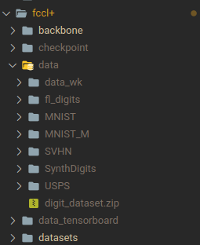

Modified Experiments

- unzip 'digits_dataset'  into a data folder within fccl+
- Make a 'data_wk/' folder inside data/
- Make a 'data_tensorboard/' folder inside fccl+/

- To run the experiments, run one of the shell scripts in `run.sh` file
- You can modify it accordingly
- All the arguments for different settings are inside `best_args.py`
- To modify which models to use, look at the fl_digits case under main.py and add the models in order of which you want to use them, you can make the list as big as you want.
- To modify the loaders look under `datasets/digits.py`
- If you are having path issues please look at `conf.py` and check if all the directories exist

- The number of global training epochs are under `training.py` line 111
- All the techniques are implemented under `models/` folder in fccl+
- The accuracies are under data_tensorboard/ folder in fccl+ in the csv files

> some techniques require pretraining, this can be set at that specific models file, i.e at  `models/fccl.py` line 29 and line 149, it has already been set to true . The order of the datasets are in MNIST, USPS, SVHN, SYNTHETIC, MNISTM (see `datasets/digits.py`)
